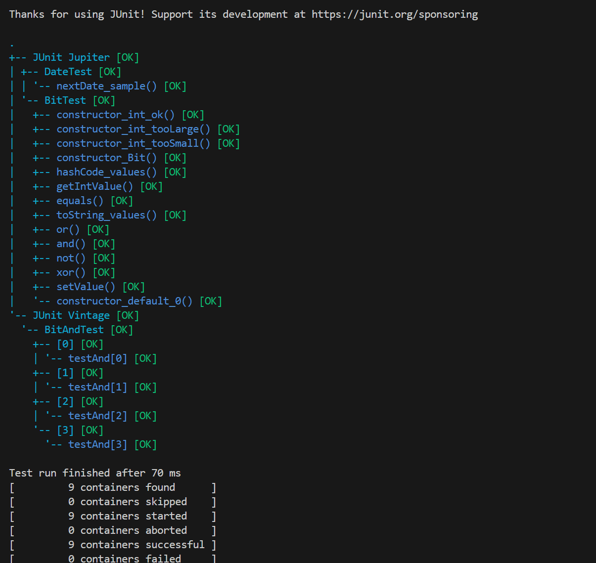

# Lab 2

## Exercise 1

`java --add-opens java.base/java.lang=ALL-UNNAMED -jar  user-registration-app-0.1.0.jar`

|Test Case	| User Name | FirstName | LastName | Email| Age | City |Postal Code
------------|------------|------------|------------|------------|------------|------------|------------|
TC1 | User00 | "" | "" | example@gmail.com | 18 | Halifax | A5B3C4
TC2 | User00000000 | Catherine | Lee | example01_now@gmail-now.com | 64 | Ottawa | B1A 4B4
TC3 | UserName1234 | John Doe | Smith Jr |  user@domain.c | 18 | Montreal | A1A1A1

| Test Case   | Expected Results   | Actual Results   | Verdict (Pass, Fail, Inconclusive)
------------|------------|------------|------------|
|TC1| valid | valid | pass
|TC2| valid | valid | pass
|TC3| Wrong Email format | Wrong Email format | pass

## Exercise 2

