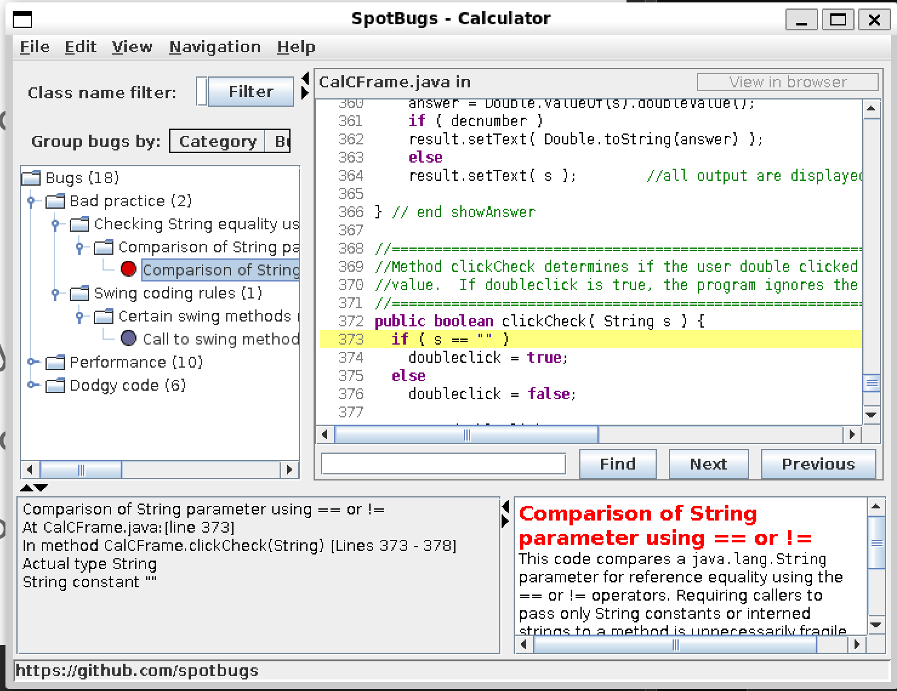
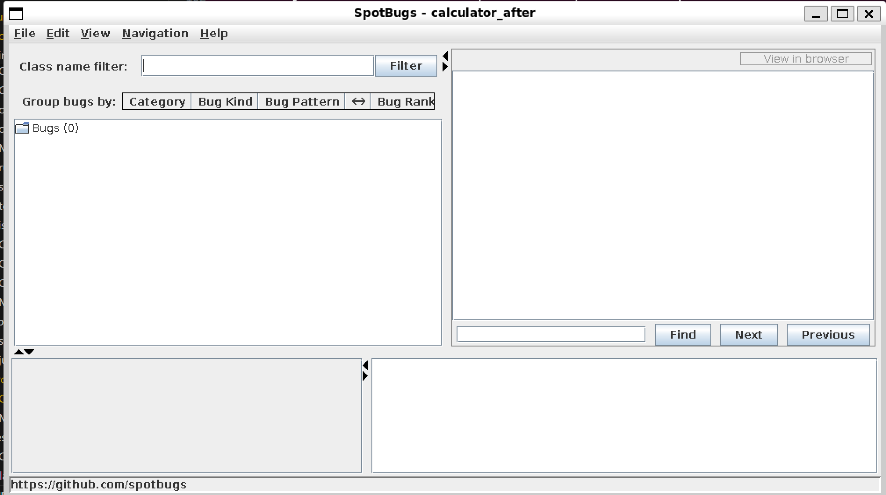

`cd /mnt/c/Users/cathe/Desktop/SEG3103/seg3103_playground/Lab7/calculator/calculator`

## Screenshots of SpotBugs

### before fixing


### after fixing


## Fix the bug

1. Comparison of String parameter using == or !=
This code compares a java.lang.String parameter for reference equality using the == or != operators. Requiring callers to pass only String constants or interned strings to a method is unnecessarily fragile, and rarely leads to measurable performance gains. Consider using the equals(Object) method instead.
```java
public boolean clickCheck( String s ) {
  if ( s == "" )
    doubleclick = true;
  else 
    doubleclick = false;
    
  return doubleclick;
}
```
Change:

```java
public boolean clickCheck(String s) {
  if (s.equals("")) {
    doubleclick = true;
  } else {
    doubleclick = false;
  }
    
  return doubleclick;
}

```

2. Certain swing methods needs to be invoked in Swing thread
(From JDC Tech Tip): The Swing methods show(), setVisible(), and pack() will create the associated peer for the frame. With the creation of the peer, the system creates the event dispatch thread. This makes things problematic because the event dispatch thread could be notifying listeners while pack and validate are still processing. This situation could result in two threads going through the Swing component-based GUI -- it's a serious flaw that could result in deadlocks or other related threading issues. A pack call causes components to be realized. As they are being realized (that is, not necessarily visible), they could trigger listener notification on the event dispatch thread.
 
Bug kind and pattern: SW - SW_SWING_METHODS_INVOKED_IN_SWING_THREAD

```java

public class Main {

	public static void main(String[] argv) {
    JFrame frame =
	  new CalCFrame("Calculator");
    frame.setSize(360,200);
    frame.setVisible(true);
  }
}
```

Change: 
```java
public class Main {
  public static void main(String[] argv) {
      run();
  }

  public static void run() {
      JFrame frame = new JFrame("Calculator");
      frame.setSize(360,200);
      frame.setVisible(true);
  }
}
```

3. 


```java

public CalCFrame(String title) {
     
    super(title);
    addWindowListener(new WindowAdapter() {
      public void windowClosing(WindowEvent e) {
      System.exit(0);
    }});


    ...
}
```

Change

```java
  private static class MyWindowAdapter extends WindowAdapter {
    public void windowClosing(WindowEvent e) {
        System.exit(0);
    }
  }
public CalCFrame(String title) {
     
    super(title);
    addWindowListener(new MyWindowAdapter());

    ...

}
```


4. Private method is never called
This private method is never called. Although it is possible that the method will be invoked through reflection, it is more likely that the method is never used, and should be removed.

Change: Comment out the method

5. Boxing/unboxing to parse a primitive
A boxed primitive is created from a String, just to extract the unboxed primitive value. It is more efficient to just call the static parseXXX method.

```java

num1 = Double.valueOf( input ).doubleValue();  // converts a string number to double

```

```java

num1 = Double.parseDouble(input);
...

num2 = Double.parseDouble(input);

...

num3 = Double.parseDouble(input);

```

6. 


```java

    answer = Double.valueOf(s).doubleValue();

```


```java

    answer = Double.parseDouble(s);

```


7. Unread field: should this field be static?
This class contains an instance final field that is initialized to a compile-time static value. Consider making the field static.

```java

 private final int   ADD=1, 
                        SUB = 2, 
                      MULT = 3, 
                      DIVI = 4, 
                      POW = 5, 
                      SQRT = 6;

```

```java

private static final int   ADD=1,        // integer constants representing operators
                      SUB = 2, 
                      MULT = 3, 
                      DIVI = 4, 
                      POW = 5, 
                      SQRT = 6;


```


8. Method uses the same code for two branches
This method uses the same code to implement two branches of a conditional branch. Check to ensure that this isn't a coding mistake.

`new CalFrame [Lines 52-97]`

```java 
for ( int i = 0; i < 19; i++ ) {
    buttons[i] = new JButton( buttonText[i] );   
    buttons[i].setFont( buttonfont );
    buttons[i].addActionListener( this );
    
    if ( i <= 2 )
        getContentPane().add( buttons[i] );
    else if ( i >= 3 && i <= 7)
        getContentPane().add( buttons[i] );
    else if ( i >=8 && i <= 12 )
        getContentPane().add( buttons[i] );
    else if ( i >= 13 && i <= 17 )
        getContentPane().add( buttons[i] );
    else
        getContentPane().add( buttons[i] );
       
    if ( i == 2 )
        getContentPane().add( new JLabel( "  " ) );
    else if ( i == 7 )
        getContentPane().add( new JLabel( "  " ) );
    else if ( i == 12 )
        getContentPane().add( new JLabel( "  " ) );
    else if ( i == 17 )
        getContentPane().add( new JLabel( "  " ) );
          
    }     
```

```java

for (int i = 0; i < 19; i++) {
    buttons[i] = new JButton(buttonText[i]);
    buttons[i].setFont(buttonfont);
    buttons[i].addActionListener(this);
    getContentPane().add(buttons[i]);

    if (i == 2 || i == 7 || i == 12 || i == 17) {
        getContentPane().add(new JLabel("  "));
    }
}


```

9. Switch statement found where default case is missing
This method contains a switch statement where default case is missing. Usually you need to provide a default case.

`CalCFrame.calcuate(int, double, double) [Lines 327-350]`

```java
switch( oper ) {
          case ADD:            
            answer = number1 + number2; 
            break;
          case SUB:            
            answer = number1 - number2;
            break;
          case MULT:
            answer = number1 * number2;
            break;
          case DIVI:
            answer = number1 / number2;
            break;
          case POW:
            answer = Math.pow( number1, number2 );
            break;
          case SQRT:
            answer = Math.sqrt( number1 );
            break;      
      } // end switch 

```

```java

switch( oper ) {
          case ADD:            
            answer = number1 + number2; 
            break;
          case SUB:            
            answer = number1 - number2;
            break;
          case MULT:
            answer = number1 * number2;
            break;
          case DIVI:
            answer = number1 / number2;
            break;
          case POW:
            answer = Math.pow( number1, number2 );
            break;
          case SQRT:
            answer = Math.sqrt( number1 );
            break;
            
          default:
            break;
      } // end switch  

```

10. Condition has no effect
This condition always produces the same result as the value of the involved variable that was narrowed before. Probably something else was meant or the condition can be removed.

`new CalCframe(String) [52-97]`

```java

 if ( i <= 2 )
        getContentPane().add( buttons[i] );
    else if ( i >= 3 && i <= 7)
        getContentPane().add( buttons[i] );
    else if ( i >=8 && i <= 12 )
        getContentPane().add( buttons[i] );
    else if ( i >= 13 && i <= 17 )
        getContentPane().add( buttons[i] );
    else
        getContentPane().add( buttons[i] );

```

This code has changed with case 8


`CalCFrame.processNumbers() [Lines 265-319]`
`this.morenums == true`

```java

 else if ( !morenums ) {      
     
      num2 = Double.valueOf( input ).doubleValue();           //converts second num to double
      answer = calculate( oldoper, num1, num2 ); //calculate num1 and num2 with   
      showAnswer( Double.toString( answer) );   //the past operator
      newoper = oper;                            //store current operator to
                                                 //new oper
      if ( !equals )
        morenums = true;        //tells program that more than two numbers have             
      else {                    //entered
        morenums = false;       //if equal operator is pressed, firstpress
        firstpress = true;      //returns to true
    } // end else
    } // end if
  
    // if more than two numbers are being inputted to calculate, this "if" block
    // is accessed
    else if (morenums) { 
      
      if ( equals ) {
       
        newoper = oper;
        morenums = false;
        firstpress = true;  // if equals is pressed set firstpress to false
    } // end if             
    
      num3 = Double.valueOf( input ).doubleValue();
      answer = calculate( newoper, answer, num3 );      
      showAnswer( Double.toString(answer) );
      
      newoper = oper;             
   }  // end else if  

```

Change
```java

if ( !morenums ) {      
     
      num2 = Double.valueOf( input ).doubleValue();           //converts second num to double
      answer = calculate( oldoper, num1, num2 ); //calculate num1 and num2 with   
      showAnswer( Double.toString( answer) );   //the past operator
      newoper = oper;                            //store current operator to
                                                 //new oper
        if ( !equals )
          morenums = true;        //tells program that more than two numbers have             
        else {                    //entered
          morenums = false;       //if equal operator is pressed, firstpress
          firstpress = true;      //returns to true
        } // end else
    } // end if
  
    // if more than two numbers are being inputted to calculate, this "if" block
    // is accessed
  else { 
      
      if ( equals ) {
       
        newoper = oper;
        morenums = false;
        firstpress = true;  // if equals is pressed set firstpress to false
      } // end if             
    
      num3 = Double.valueOf( input ).doubleValue();
      answer = calculate( newoper, answer, num3 );      
      showAnswer( Double.toString(answer) );
      
      newoper = oper;             
  }  // end else if  

```